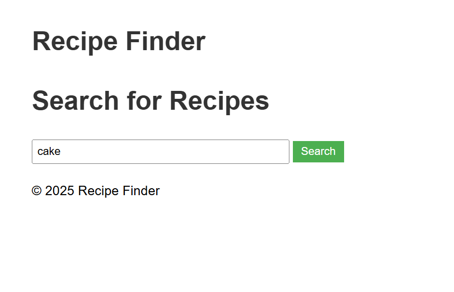

# Create a virtual environment
python -m venv venv

# Activate the virtual environment
# On Windows
venv\Scripts\activate
# On Mac/Linux
source venv/bin/activate

# Install Django and requests
pip install django requests

# Install all requirements
pip install -r requirements.txt

# Run
py manage.py runserver

- Tailwind should be properly configured in `settings.py` using [django-tailwind](https://django-tailwind.readthedocs.io/en/latest/).

## Environment Variables

This project uses an [Spoonacular API](https://spoonacular.com/food-api/console#Dashboard) API key. To run the project, create a `.env` file in the root directory and add the following:

NEWS_API_KEY="your_actual_api_key_here"
